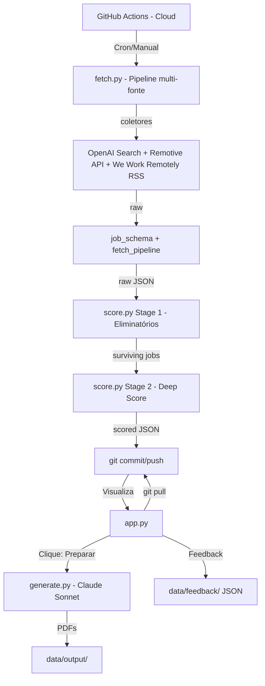

# Arquitetura - Job Radar

Este documento descreve o design técnico, a organização do sistema e as decisões arquiteturais. Serve como a fonte da verdade para o **estado atual** do projeto. Status e próximos passos: [ROADMAP.md](ROADMAP.md).

## 🏗️ Visão Geral

O sistema é dividido em um pipeline de dados (nuvem/Actions) e uma interface de consumo (local/Streamlit).

### Mapa do Sistema



### Componentes e Responsabilidades

| Componente | Script / Módulo | Modelo/Motor | Papel |
| :--- | :--- | :--- | :--- |
| **Search** | `src/fetch.py` (CLI) + `job_schema.py` + `fetch_pipeline.py` + `seen_jobs.py` + `collectors/*` | OpenAI Search, Remotive API, We Work Remotely RSS, Jobicy | Orquestra coletores, normaliza para schema único, dedupe persistente (`data/seen_jobs.json`) + throttle 20 novos/run, quality guard, métricas de cobertura no JSON, grava em `data/raw/`. |
| **Score** | `src/score.py` | Claude Haiku | Processo em 2 etapas: Eliminatórios (batch) e Deep Scoring (individual) contra o `config/profile.md`. |
| **Interface** | `app.py` | Streamlit | UI para revisão, feedback e acionamento de geração. |
| **Writer** | `src/generate.py`| Claude Sonnet | Redação de alta qualidade para CV e Cover Letter. |
| **Notifier** | `src/notify.py` | SMTP | Alertas imediatos para `PERFECT_MATCH` (score > 95). |

### Decisões Técnicas (Rationale)

| Decisão | Escolha | Motivo |
| :--- | :--- | :--- |
| **Busca de vagas** | Pipeline multi-fonte: OpenAI Search, Remotive, We Work Remotely, Jobicy (Épico 2); dedup persistente + throttle (2.7). | Coletores independentes; schema único; dedupe cross-fonte; `seen_jobs.json` evita reprocessar vagas entre runs; throttle limita a 20 novos JDs/run (preparado para ATS). |
| **Scoring** | Claude Haiku | Rápido e barato para análise de texto longo. |
| **Geração de materiais** | Claude Sonnet | Escrita superior e tom profissional. |
| **Interface** | Streamlit Local | Agilidade no desenvolvimento e custo zero de hospedagem. |
| **Pipeline** | GitHub Actions | Gratuito, automatizado e confiável (nuvem). |
| **Persistência** | JSON (Data-as-Code) | Simplicidade; controle de versão serve como banco de dados. |

---

## 📂 Estrutura do Projeto

```text
job-radar/
├── app.py                       # Interface Streamlit principal
├── src/
│   ├── fetch.py                 # CLI: orquestra coletores e grava raw
│   ├── job_schema.py            # Schema único + make_id_hash, normalize_job
│   ├── fetch_pipeline.py        # run_pipeline, apply_seen_jobs_filter, remove_duplicates, filter_old_jobs, apply_quality_guard, load_config
│   ├── seen_jobs.py             # load_seen, is_seen, mark_seen, save_seen (dedup persistente; único acesso a data/seen_jobs.json)
│   ├── collectors/              # Um módulo por fonte de vagas
│   │   ├── __init__.py
│   │   ├── remotive.py          # API Remotive (product, project-management; 48h)
│   │   ├── weworkremotely.py    # RSS We Work Remotely (management/finance; filtro PM/TPM)
│   │   ├── jobicy.py            # API Jobicy (industry=product; 48h)
│   │   └── openai_search.py    # OpenAI gpt-4o-mini web search
│   ├── score.py                 # Scoring via Claude Haiku
│   ├── generate.py              # Writer via Claude Sonnet
│   └── notify.py                # Alertas SMTP
├── config/
│   ├── career_narrative.md      # Fonte de verdade da carreira
│   ├── profile.md               # Perfil condensado para LLMs
│   ├── resume_base.md           # Templates modulares de currículo
│   └── search.yaml              # Parâmetros de busca e pesos
├── data/
│   ├── seen_jobs.json           # Dedup persistente (id_hash → first_seen, source, title, company); commitado pelo Actions
│   ├── raw/                     # JSONs brutos (YYYY-MM-DD_HHMMSS.json); inclui "coverage" com métricas por etapa
│   ├── scored/                  # JSONs filtrados (YYYY-MM-DD_HHMMSS.json)
│   ├── feedback/                # Feedback 👍/👎 (local)
│   └── output/                  # PDFs gerados
└── .github/workflows/
    └── daily.yml                # Pipeline de automação (Cron)
```

## ⚙️ Infraestrutura e Ambiente

- **Linguagem**: Python 3.11+
- **APIs**: OpenAI (Search Preview), Remotive (pública, sem key), We Work Remotely (RSS público), Anthropic (Claude).
- **Ambiente**: Produção simulada via GitHub Actions; Consumo via Streamlit local. Usar **venv** para desenvolvimento e validação (`python -m venv .venv` ou `venv`).
- **Segurança**: Chaves de API via `.env` (local) e Secrets (GitHub).

---

## 📋 Notas de desenvolvimento

- **Venv:** Sempre rodar com ambiente virtual e `pip install -r requirements.txt` antes de validar; evita `ModuleNotFoundError` em máquinas novas.
- **Windows / encoding:** O console (cp1252) pode gerar `UnicodeEncodeError` em logs com emoji. Em `fetch.py` o stdout/stderr é forçado para UTF-8 quando necessário; em novos scripts CLI, repetir o padrão ou evitar emojis.
- **Testes:** O projeto ainda não tem suíte automatizada (pytest). Recomenda-se adicionar smoke test (`python src/fetch.py --dry-run`) ou testes unitários para `job_schema` e pipeline antes de escalar novos coletores.

---
**Última atualização:** 24 de Fevereiro de 2026


