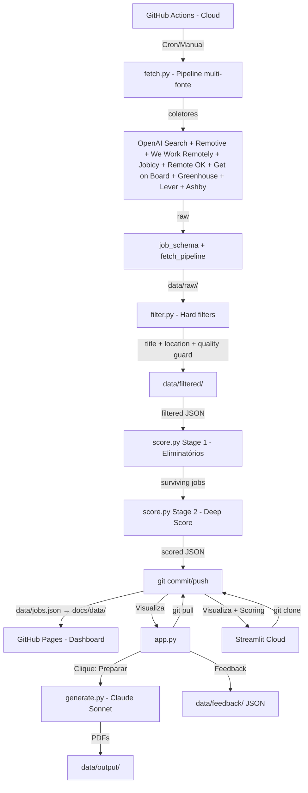

# Arquitetura - Job Radar

Este documento descreve o design técnico, a organização do sistema e as decisões arquiteturais. Serve como a fonte da verdade para o **estado atual** do projeto. Status e próximos passos: [ROADMAP.md](ROADMAP.md).

## 🏗️ Visão Geral

O sistema é dividido em um pipeline de dados (nuvem/Actions), uma interface de consumo (local/Streamlit) e um dashboard estático (GitHub Pages).

### Mapa do Sistema



### Componentes e Responsabilidades

| Componente | Script / Módulo | Modelo/Motor | Papel |
| :--- | :--- | :--- | :--- |
| **Search** | `src/fetch.py` (CLI) + `job_schema.py` + `fetch_pipeline.py` + `seen_jobs.py` + `collectors/*` | OpenAI Search, Remotive, We Work Remotely, Jobicy, Remote OK, Get on Board, Greenhouse, Lever, Ashby (Épicos 3.2–3.4, 7.2) | Orquestra coletores, normaliza para schema único, dedupe persistente (`data/seen_jobs.json`) + throttle 20 novos/run, quality guard, métricas de cobertura no JSON, grava em `RAW_DIR` (`src/paths.py`). Janela de coleta de 7 dias nos coletores com filtro de recência (Remotive, Jobicy, Remote OK, Get on Board); fontes sem recorte client-side (WWR feed master, ATS) trazem todas as vagas abertas. |
| **Paths** | `src/paths.py` | — | Single source of truth para diretórios do projeto. Lê output de search.yaml, expõe RAW_DIR, FILTERED_DIR, SCORED_DIR, etc. como Path objects. |
| **Filter** | `src/filter.py` | — | Hard filters gratuitos: title (exclude_title_keywords de search.yaml) + location (blocklist + allowlist) + quality guard (JD/título/empresa). Lê `data/raw/`, grava `data/filtered/` (mesmo nome; jd_full intacto). CLI: `--input` ou `--date`. `data/filtered/` no .gitignore. |
| **Score** | `src/score.py` | Claude Haiku | Lê de `data/filtered/`. Eliminatórios em batch com payload completo (title, company, location, jd_full). Deep Scoring individual com JD truncado a 3000 chars no prompt (não no armazenamento). Chamada 1 (analyze_job) retorna `penalties` como dict de bools (seniority_gap, domain_gap_core); compute_ceiling calcula teto em Python; Chamada 2 (score_with_analysis) recebe análise + ceiling e atribui score final (early return se ceiling ≤ 50, senão Haiku com teto explícito). main() executa esse pipeline por vaga; output por vaga inclui score_ceiling, ceiling_reason, core_requirements, seniority_comparison. Contra `config/profile.md`. |
| **Interface** | `app.py` | Streamlit | Duas abas: **Vagas** (tabela unificada de `data/scored/`: pipeline + manual_*.json; filtro por data; cards com score, veredito APLICAR/AVALIAR/PULAR, fonte, salário quando existir, link; expand com análise completa) e **Busca Manual** (links de `config/manual_searches.yaml` + paste-and-score: normalize_job → analyze_job → compute_ceiling → score_with_analysis; salva em `data/scored/manual_YYYY-MM-DD_HHMMSS.json` com hora local no nome e UTC em scored_at; atualiza `seen_jobs.json`). Funciona local e em Streamlit Cloud (filesystem efêmero no cloud; persistência graceful para scoring manual — resultado sempre aparece mesmo se gravação falhar). Depende de `src/score.py`, `src/job_schema.py`, `src/seen_jobs.py`, `src/paths.py`. Revisão, feedback e acionamento de geração. |
| **Writer** | `src/generate.py`| Claude Sonnet | Redação de alta qualidade para CV e Cover Letter. |
| **Notifier** | `src/notify.py` | SMTP | Alertas imediatos para `PERFECT_MATCH` (score > 95). |
| **Frontend Data** | `src/build_frontend_data.py` | — | Consolida `data/scored/` em `data/jobs.json`. O workflow copia para `docs/data/jobs.json` para o GitHub Pages servir. Filtra últimos 14 dias, ordena por data e score. Roda no pipeline diário (Actions) e como CLI. |
| **Eval** | `src/eval/build_gabarito.py`, `eval_eliminatorios.py`, `test_scoring.py`, `validate_scoring_pipeline.py` | — | Infraestrutura de avaliação: gabarito machine-readable, eval parametrizado por modelo; testes de scoring (compute_ceiling); validação do pipeline de 2 chamadas no seed (5.1.5) via `--seed <path>`. |

### Decisões Técnicas (Rationale)

| Decisão | Escolha | Motivo |
| :--- | :--- | :--- |
| **Busca de vagas** | Pipeline multi-fonte: OpenAI Search, Remotive, We Work Remotely, Jobicy (Épico 2); dedup persistente + throttle (2.7). | Coletores independentes; schema único; dedupe cross-fonte; `seen_jobs.json` evita reprocessar vagas entre runs; throttle limita a 20 novos JDs/run (preparado para ATS). |
| **Scoring** | Claude Haiku | Rápido e barato para análise de texto longo. |
| **Geração de materiais** | Claude Sonnet | Escrita superior e tom profissional. |
| **Interface** | Streamlit Local | Agilidade no desenvolvimento e custo zero de hospedagem. |
| **Pipeline** | GitHub Actions | Gratuito, automatizado e confiável (nuvem). |
| **Persistência** | JSON (Data-as-Code) | Simplicidade; controle de versão serve como banco de dados. |
| **Eval / Gabarito** | Gabarito JSON + script parametrizado por modelo | Permite medir impacto de cada mudança (filtro, prompt, modelo) de forma repetível. Reutilizável para scoring (Épico 5). |

---

## 📂 Estrutura do Projeto

```text
job-radar/
├── app.py                       # Interface Streamlit principal
├── src/
│   ├── fetch.py                 # CLI: orquestra coletores e grava raw
│   ├── job_schema.py            # Schema único + make_id_hash, normalize_job
│   ├── fetch_pipeline.py        # run_pipeline, apply_seen_jobs_filter, remove_duplicates, filter_old_jobs, apply_quality_guard, load_config
│   ├── seen_jobs.py             # load_seen, is_seen, mark_seen, save_seen (dedup persistente; único acesso a data/seen_jobs.json)
│   ├── collectors/              # Um módulo por fonte de vagas
│   │   ├── __init__.py
│   │   ├── remotive.py          # API Remotive (product, project-management; janela 7d)
│   │   ├── weworkremotely.py    # RSS We Work Remotely (feed master; filtro PM/TPM por título)
│   │   ├── jobicy.py            # API Jobicy (industry=product; janela 7d)
│   │   ├── remoteok.py          # API Remote OK (Épico 7.2; tags/position PM; janela 7d; Source: Remote OK)
│   │   ├── getonboard.py        # API Get on Board (Épico 7.2; LATAM, product manager remote; paginação até 5 páginas)
│   │   ├── greenhouse.py       # Greenhouse Job Board API (Épico 3.2; companies.yaml ats=greenhouse)
│   │   ├── lever.py            # Lever Postings API (Épico 3.3; companies.yaml ats=lever)
│   │   ├── ashby.py            # Ashby Job Board API (Épico 3.4; companies.yaml ats=ashby; POST)
│   │   └── openai_search.py    # OpenAI gpt-4o-mini web search
│   ├── build_frontend_data.py   # Consolida scored → data/jobs.json (workflow copia para docs/data/)
│   ├── filter.py                # Hard filters (location + quality); raw → filtered
│   ├── score.py                 # Scoring via Claude Haiku (lê filtered)
│   ├── generate.py              # Writer via Claude Sonnet
│   ├── notify.py                # Alertas SMTP
│   ├── eval/                    # Scripts de avaliação e benchmarking
│   │   ├── __init__.py
│   │   ├── build_gabarito.py    # Gera gabarito machine-readable a partir de lista curada
│   │   ├── eval_eliminatorios.py  # Eval reutilizável: hard filters + LLM vs gabarito
│   │   └── test_scoring.py     # Testes de compute_ceiling (4 cenários); rodar: python src/eval/test_scoring.py
├── config/
│   ├── career_narrative.md      # Fonte de verdade da carreira
│   ├── profile.md               # Perfil condensado para LLMs
│   ├── resume_base.md           # Templates modulares de currículo
│   ├── search.yaml              # Parâmetros de busca e pesos
│   └── manual_searches.yaml     # Links de busca manual (UI: aba Busca Manual)
├── data/
│   ├── seen_jobs.json           # Dedup persistente (id_hash → first_seen, source, title, company); commitado pelo Actions
│   ├── jobs.json                # Consolidado para frontend (build_frontend_data.py); workflow copia para docs/data/
│   ├── raw/                     # JSONs brutos (YYYY-MM-DD_HHMMSS.json); inclui "coverage" com métricas por etapa
│   ├── filtered/                 # JSONs após hard filters (mesmo nome do raw); .gitignore
│   ├── scored/                  # JSONs pontuados (YYYY-MM-DD_HHMMSS.json = data/hora da execução; lote em source_file)
│   ├── feedback/                # Feedback 👍/👎 (local)
│   └── output/                  # PDFs gerados
├── docs/
│   ├── index.html               # Dashboard GitHub Pages (HTML+CSS+JS inline; fetch em data/jobs.json)
│   └── data/
│       └── jobs.json            # Cópia de data/jobs.json para o Pages servir (gerada no workflow)
└── .github/workflows/
    └── daily.yml                # Pipeline de automação (Cron)
```

## ⚙️ Infraestrutura e Ambiente

- **Linguagem**: Python 3.11+
- **APIs**: OpenAI (Search Preview), Remotive (pública, sem key), We Work Remotely (RSS público), Anthropic (Claude).
- **Ambiente**: Produção simulada via GitHub Actions; Consumo via Streamlit local. Usar **venv** para desenvolvimento e validação (`python -m venv .venv` ou `venv`).
- **Streamlit Cloud**: App hospedado em share.streamlit.io. Secrets via `st.secrets` (bridge para `os.environ` no `app.py`). Filesystem efêmero — scoring manual funciona mas resultados não persistem entre restarts (resolvido no Épico 10 via GitHub API). Repo clonado automaticamente; `data/scored/` commitado pelo Actions fica disponível.
- **GitHub Pages**: Dashboard read-only em `docs/` (source: branch `main`, pasta `/docs/`). `build_frontend_data.py` gera `data/jobs.json`; o workflow copia para `docs/data/jobs.json`; `docs/index.html` consome via fetch em `data/jobs.json`.
- **Segurança**: Chaves de API via `.env` (local) e Secrets (GitHub).

---

## 📋 Notas de desenvolvimento

- **Venv:** Sempre rodar com ambiente virtual e `pip install -r requirements.txt` antes de validar; evita `ModuleNotFoundError` em máquinas novas.
- **Windows / encoding:** O console (cp1252) pode gerar `UnicodeEncodeError` em logs com emoji. Em `fetch.py` o stdout/stderr é forçado para UTF-8 quando necessário; em novos scripts CLI, repetir o padrão ou evitar emojis.
- **Testes:** O projeto ainda não tem suíte automatizada (pytest). Recomenda-se adicionar smoke test (`python src/fetch.py --dry-run`) ou testes unitários para `job_schema` e pipeline antes de escalar novos coletores.
 - **Streamlit Cloud / secrets:** O `app.py` inclui bridge que copia `st.secrets` para `os.environ` na inicialização. Funciona tanto local (`.env` via `load_dotenv`) quanto em cloud (`st.secrets`). Se adicionar nova env var, incluir no bridge e no `.streamlit/secrets.toml.example`.

---
**Última atualização:** Mar 2026


