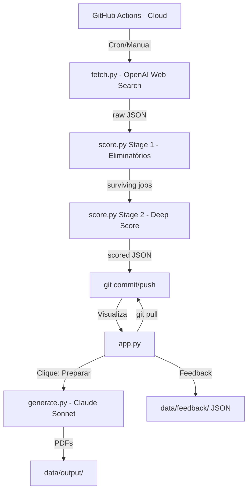

# Arquitetura - Job Radar

Este documento descreve o design técnico, a organização do sistema e as decisões arquiteturais. Serve como a fonte da verdade para o **estado atual** do projeto. Status e próximos passos: [ROADMAP.md](ROADMAP.md).

## 🏗️ Visão Geral

O sistema é dividido em um pipeline de dados (nuvem/Actions) e uma interface de consumo (local/Streamlit).

### Mapa do Sistema



### Componentes e Responsabilidades

| Componente | Script | Modelo/Motor | Papel |
| :--- | :--- | :--- | :--- |
| **Search** | `src/fetch.py` | GPT-4o-mini + Search | Navega em LinkedIn, Indeed, etc., para buscar vagas brutas. |
| **Score** | `src/score.py` | Claude Haiku | Processo em 2 etapas: Eliminatórios (batch) e Deep Scoring (individual) contra o `config/profile.md`. |
| **Interface** | `app.py` | Streamlit | UI para revisão, feedback e acionamento de geração. |
| **Writer** | `src/generate.py`| Claude Sonnet | Redação de alta qualidade para CV e Cover Letter. |
| **Notifier** | `src/notify.py` | SMTP | Alertas imediatos para `PERFECT_MATCH` (score > 95). |

### Decisões Técnicas (Rationale)

| Decisão | Escolha | Motivo |
| :--- | :--- | :--- |
| **Busca de vagas** | OpenAI GPT-4o-mini + Search (implementação atual) | Cobertura via web search; evolução planejada em ROADMAP. |
| **Scoring** | Claude Haiku | Rápido e barato para análise de texto longo. |
| **Geração de materiais** | Claude Sonnet | Escrita superior e tom profissional. |
| **Interface** | Streamlit Local | Agilidade no desenvolvimento e custo zero de hospedagem. |
| **Pipeline** | GitHub Actions | Gratuito, automatizado e confiável (nuvem). |
| **Persistência** | JSON (Data-as-Code) | Simplicidade; controle de versão serve como banco de dados. |

---

## 📂 Estrutura do Projeto

```text
job-radar/
├── app.py                       # Interface Streamlit principal
├── src/
│   ├── fetch.py                 # Core: Busca via OpenAI Search
│   ├── score.py                 # Core: Scoring via Claude Haiku
│   ├── generate.py              # Core: Writer via Claude Sonnet
│   └── notify.py                # Utilitário: Alertas SMTP
├── config/
│   ├── career_narrative.md      # Fonte de verdade da carreira
│   ├── profile.md               # Perfil condensado para LLMs
│   ├── resume_base.md           # Templates modulares de currículo
│   └── search.yaml              # Parâmetros de busca e pesos
├── data/
│   ├── raw/                     # JSONs brutos (YYYY-MM-DD_HHMMSS.json)
│   ├── scored/                  # JSONs filtrados (YYYY-MM-DD_HHMMSS.json)
│   ├── feedback/                # Feedback 👍/👎 (local)
│   └── output/                  # PDFs gerados
└── .github/workflows/
    └── daily.yml                # Pipeline de automação (Cron)
```

## ⚙️ Infraestrutura e Ambiente

- **Linguagem**: Python 3.11+
- **APIs**: OpenAI (Search Preview), Anthropic (Claude).
- **Ambiente**: Produção simulada via GitHub Actions; Consumo via Streamlit local.
- **Segurança**: Chaves de API via `.env` (local) e Secrets (GitHub).

---
**Última atualização:** 23 de Fevereiro de 2026


